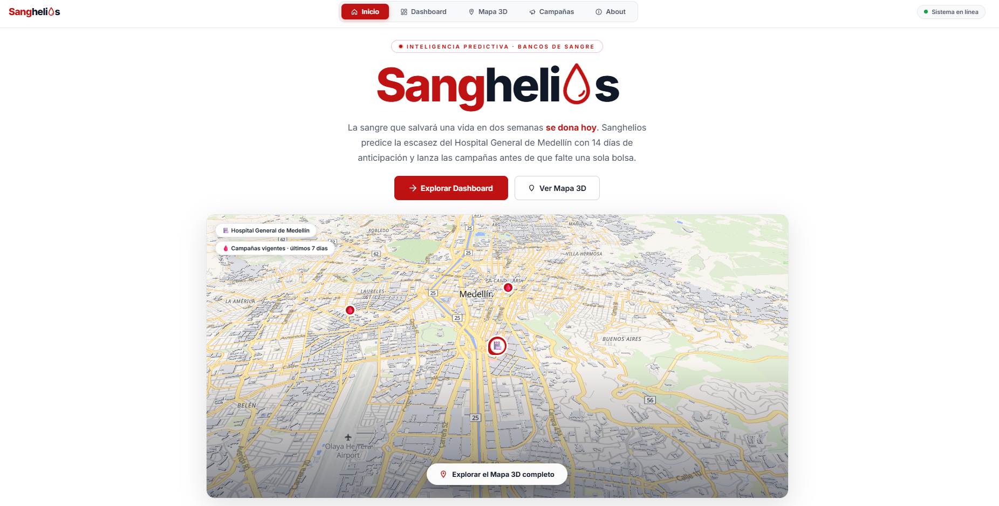
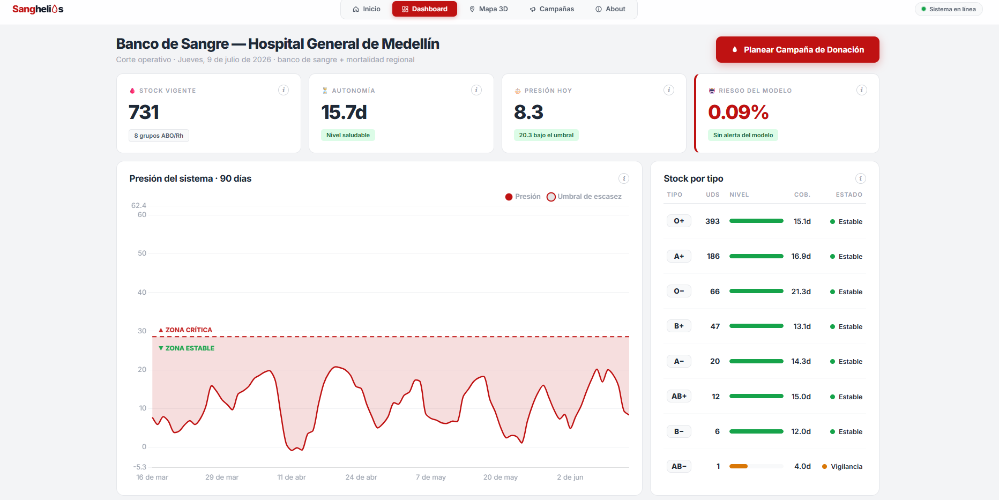
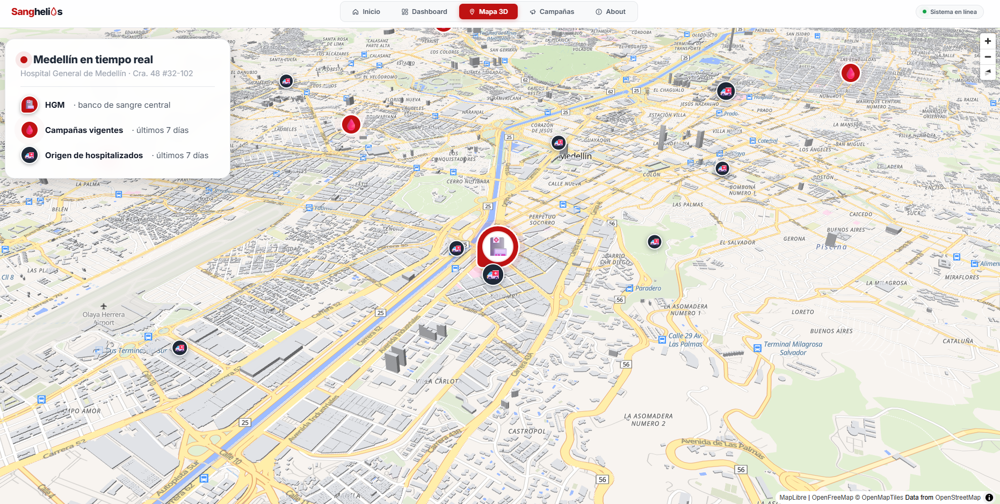
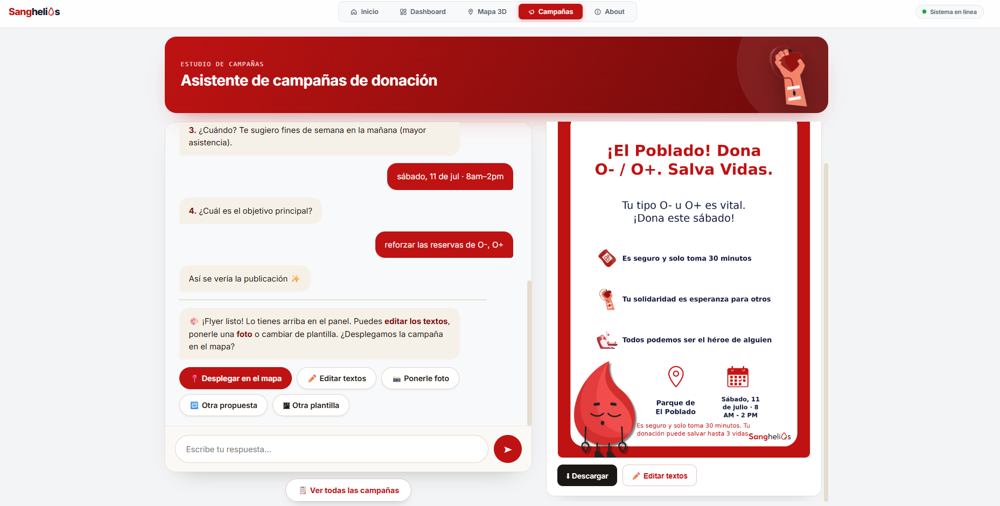
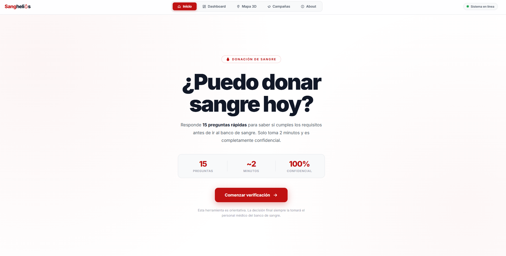

<div align="center">


**Inteligencia predictiva para bancos de sangre**

Anticipa la escasez de sangre del Hospital General de Medellín con 14 días de
anticipación y convierte esa señal en campañas de donación diseñadas con IA.


</div>

---

La **presión** del sistema (demanda − oferta, media móvil de 7 días) se compara
contra un umbral τ. Si el modelo ve escasez a 14 días, el asistente de IA diseña
la campaña, genera el flyer y la despliega en el mapa.

<div align="center">

[](https://main.jero98772.page/sanghelios/)
&nbsp;
[](https://www.youtube.com/watch?v=7mOG2cgMJ0c)

</div>

## Índice

- [Módulos](#módulos)
- [Datos abiertos](#datos-abiertos)
- [Ejecutar](#ejecutar)
- [Estructura](#estructura)
- [Documentación](#documentación)
- [Equipo](#equipo)

## Módulos

<table>
  <tr>
    <td align="center" colspan="2">
      <br>
      <b>Inicio</b><br><sub>El estado del banco de sangre de un vistazo</sub>
    </td>
  </tr>
  <tr>
    <td align="center" width="50%">
      <br>
      <b>Dashboard</b><br><sub>Stock vigente, presión vs τ y riesgo a 14 días</sub>
    </td>
    <td align="center" width="50%">
      <br>
      <b>Mapa 3D</b><br><sub>Campañas activas con su flyer y origen de la demanda</sub>
    </td>
  </tr>
  <tr>
    <td align="center" width="50%">
      <br>
      <b>Estudio de campañas</b><br><sub>El asistente IA propone la campaña y genera el flyer</sub>
    </td>
    <td align="center" width="50%">
      <br>
      <b>¿Puedo donar?</b><br><sub>Test de aptitud y puntos de donación cercanos</sub>
    </td>
  </tr>
</table>

</div>

## Datos abiertos

| Conjunto ([datos.gov.co](https://www.datos.gov.co) · HGM) | Registros | Rol |
|---|--:|---|
| [Banco de sangre](https://www.datos.gov.co/Salud-y-Protecci-n-Social/Banco-de-sangre-Hospital-General-de-Medell-n/65is-zhxx/about_data) | 35.840 | Oferta: donaciones |
| [Población atendida](https://www.datos.gov.co/Salud-y-Protecci-n-Social/Poblaci-n-atendida-en-el-Hospital-General-de-Medel/xm8g-qeac/about_data) | 221.203 | Demanda: hospitalizaciones |
| [Defunciones](https://www.datos.gov.co/Salud-y-Protecci-n-Social/Defunciones-ocurridas-en-en-el-Hospital-General-de/hwwv-mhse/about_data) | 5.094 | Demanda: muertes asociadas a sangre |

## Ejecutar

```bash
uv sync                                       # dependencias
uv run python scripts/build_db_and_model.py   # (una vez) modelo + base de datos
uv run uvicorn src.app:app --port 8000        # http://localhost:8000
```

Variables de entorno en `.env`: `GEMINI_API_KEY` para el
asistente de campañas y la búsqueda de lugares.

## Estructura

```
Sanghelios/
├── RECURSOS/        material visual · presentación Manim · capturas
├── docs/            metodología · impacto · validación · API · arquitectura
├── data/            raw · processed · realtime · sanghelios.db
├── notebooks/       01_EDA → 02_limpieza → 03_descriptivo → 04_modelo → 05_reportes
├── src/             app web · agents/ · data_pipeline/ · features/ · train · inference
├── models/          predictive/escasez_model.pkl
├── reports/         figuras · reporte automático · reporte_final.html
├── tests/           unit · integration · bias_tests
├── config/          configuración e hiperparámetros
└── deployments/     docker · kubernetes · serverless
```

## Documentación

- [Marco metodológico](docs/marco_metodologico.md)
- [Impacto público](docs/public_impact_assessment.md)
- [Guía de validación](docs/validación_guide.md)
- [Arquitectura](docs/architecture/README.md)
- [API](docs/api_spec.md)
- [Conclusiones](docs/conclusiones.md)

## Equipo

| | Rol | Formación |
|---|---|---|
| **Jerónimo Hoyos** | Ingeniero en IA | Ing. de Sistemas e Informática · UNAL Medellín |
| **Daniel Arango** | Ingeniero de Software | Ing. de Sistemas · EAFIT |
| **Jose Miguel García** | Data Scientist | Estadística · UNAL Medellín |
| **Valentina Muñoz** | Diseñadora | Ing. Administrativa · UNAL Medellín |

<div align="center">
<sub>Hospital General de Medellín · Banco de sangre · 2026</sub>
</div>