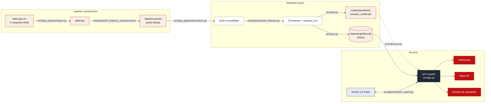

# Arquitectura

**Del dato abierto a la campaña: pipeline batch + API + asistente generativo**

[README](../../README.md) · [Marco metodológico](../marco_metodologico.md) · [API](../api_spec.md) · [Diccionario](../data_dictionary.md)

---

## Vista general

## Componentes

| Componente | Ruta | Responsabilidad |
|---|---|---|
| **Ingesta** | `src/data_pipeline/ingest.py` | Espejo local de los conjuntos de datos.gov.co (Socrata) |
| **Transformación** | `src/data_pipeline/transform.py` | Series procesadas → serie diaria continua consolidada |
| **Features** | `src/features/build_features.py` | Presión, rezagos, estacionalidad y objetivo `escasez_t14` |
| **Entrenamiento** | `src/train.py` | XGBoost + umbral F2 out-of-fold; exporta modelo y BD |
| **Inferencia** | `src/inference.py` | Carga el bundle y predice probabilidad de escasez |
| **API + web** | `src/app.py` · `src/templates/` · `src/static/` | Rutas HTML y `/api/*` (serie, stock, campañas, meta) |
| **Agente ciudadano** | `src/agents/citizen_agent.py` | Asistente conversacional de campañas (Gemini + reglas de respaldo) y búsqueda de lugares |
| **Agente analista** | `src/agents/analyst_agent.py` | Reporte automático del estado del banco a partir de la BD operativa |
| **Flyers** | `src/tools/write_images.py` | Relleno de plantillas de afiches (PIL) |
| **Presentación** | `RECURSOS/presentation/` | Diapositivas Manim del proyecto |

## Decisiones de arquitectura

- **Batch, no streaming**: los datos abiertos se actualizan con baja frecuencia;
  un pipeline batch reproducible (`scripts/build_db_and_model.py`) es más simple
  y auditable que un flujo en tiempo real. `data/realtime/` queda reservado para
  una futura integración con el sistema transfusional del hospital.
- **SQLite como BD operativa**: una sola tabla diaria + stock + campañas; sin
  servidor de BD que administrar, ideal para réplica en otros hospitales.
- **Degradación elegante de la IA**: si no hay `GEMINI_API_KEY`, el asistente
  cae a un generador por reglas — la aplicación nunca depende de un servicio
  externo para funcionar.

---

Sanghelios · Hospital General de Medellín · 2026

